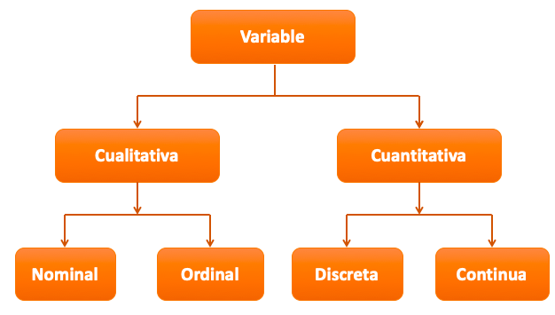
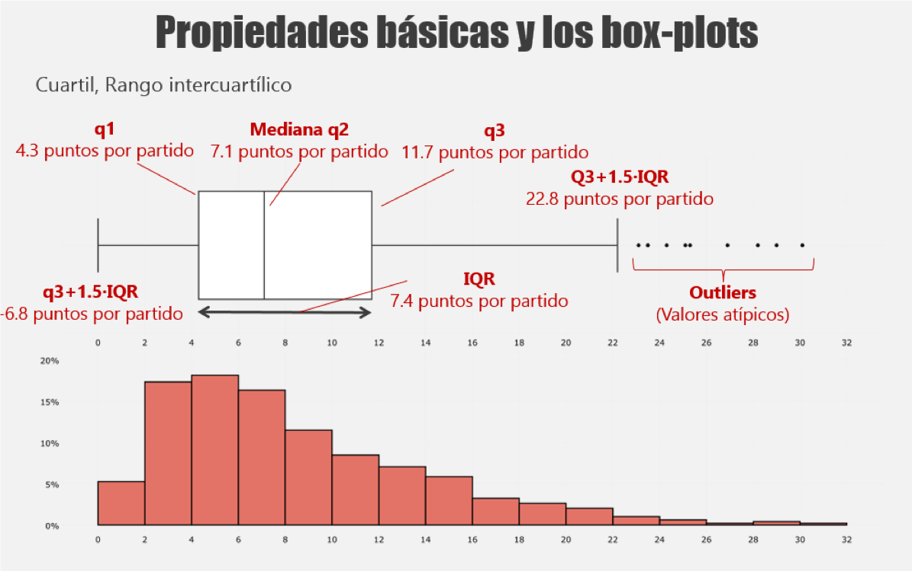

```{r setup, include=FALSE}
knitr::opts_chunk$set(echo = FALSE)
library(MASS)
library(psych)
library(ggplot2)
library(fishdata)
library(pander)
library(dplyr)
require(gridExtra)
library(grid)
```

## PLAN DE LA CLASE
**1.- Introducción**
    
- ¿Qué es un análisis exploratorio de datos (EDA)?.
- ¿Por qué es importante?.
- Clasificación de variables.
- Variables discretas.
- Distribución Bernoulli y Binomial negativa.
- Gráficas avanzadas con ggplot2

**2.- Práctica con R y Rstudio cloud**

- Realizar un análisis exploratorio de datos.
- Realizar gráficas avanzadas con ggplot2. 

## ANÁLISIS EXPLORATORIO DE DATOS (EDA)

**¿Qué es un análisis exploratorio de datos?**  
Procedimiento que permite visualizar y explorar los datos de un estudio.  
**¿Para qué?**  
1- Investigar calidad de los datos brutos.  

2- Limpiar datos.  

3- Observar variación de los datos.  

4- Establecer un modelo básico de relación e interacción entre variables.  

5- Seleccionar una prueba estadÍstica adecuada.   

## EDA ES UN PROCESO ITERATIVO

**¿Cómo realizar un buen EDA?**

1- Genera preguntas iniciales para explorar tus datos.

2- Resume, visualiza, transforma y modela tus datos.

3- Usa lo que aprendiste para generar nuevas preguntas.

**Preguntas clave, pero no las únicas**  

- ¿Qué tipo de variación existe en la/s variables de estudio?  

- ¿Qué tipo de covariación o interacción existe entre las variables de estudio?  

- ¿Cuál es el modelo más simple que explica la relación entre variables?

- ¿Existen errores, datos faltantes, valores atípicos?


## EDA: CLASIFICACIÓN DE VARIABLES.

```{r, echo=FALSE, out.width = '100%', fig.align='center'}

```

## **VARIABLES ALEATORIAS DISCRETAS**

Las variables aleatorias discretas son aquellas que presentan un número contable de valores; por ejemplo:

* **Número de parásitos** (1, 3, 5, 6, etc.).

* **Número de especies**.

* **Número de huevos**.

## **IDENTIFICA CORRECTAMENTE TU VARIABLE**

* Es importante identificar la naturaleza que tiene nuestra variable en estudio, y así evitar errores en los análisis estadísticos que llevemos a cabo. 

* Usualmente cuando las variables en estudio son conteos, proporciones o binarias (éxito o fracaso, macho o hembra, sano o enfermo) deben ser consideradas como **variables aleatorias discretas**. 

* Según sea la variable aleatoria discreta, ella tendrá una función de distribución de probabilidad asociada que **NO** es normal. Por ejemplo: **Bernoulli, Binomial, Binomial Negativa, Poisson, entre otras**. 

* En gran parte, la **_distribución de variables aleatorias discretas_** suelen ser **asimétricas a derecha o a izquierda**.

## **OBSERVAR CON BOXPLOT**

Las gráficas de cajas y bigotes son muy adecuadas para observar variables aleatorias discretas.

[^1]: **IQR =** **_Rango intercuantílico_** es la diferencia entre el tercer cuartil (75%) y el primer cuartil (25%) de una distribución.

```{r, echo=FALSE, out.width = '80%', fig.align='center'}


```

## **VARIABLE DISCRETA: DISTRIBUCIÓN BERNOULLI**

*Alexandrium catenella* es una microalga tóxica que produce el veneno paralizante de los mariscos (VPM). En Chile las intoxicaciones por VPM entre 1972-2002 generaron 456 enfermos y 30 fallecidos (total = 486). Sea X=1 si la persona muere y X=0 en el caso de sobrevive. ¿Cuál es la distribución de X?. 30/456 = éxito, 426/456 = fracaso.

|             | Fracaso | Éxito |
|-------------|---------|-------|
| x           | 0       | 1     |
| f(x)=P(X=x) | 1-p     | p     |
|             | 0.94    | 0.06  |

```{r, echo=FALSE, out.width = '70%', fig.align='center'}
knitr::include_graphics("fbernoulli.png")
```

## **VARIABLE DISCRETA: DISTRIBUCIÓN BERNOULLI**

Representación en un histograma de la frecuencia de recuperados y fallecidos.
```{r, out.width = '80%'}
rvpm <- rbinom(500, size=1, prob=0.06) 
hist(rvpm, col="red", main = "Histograma Intoxicación por VPM")
```

## **VARIABLE DISCRETA: DISTRIBUCIÓN BINOMIAL NEGATIVA**

Simulación del número de parásitos por pez.

```{r, echo=FALSE, out.width = '80%', fig.align='center', fig.cap="Número de parásitos por pez."}
set.seed(123)
# n = 1000 peces
# mu = 4 (Parásitos por pez)
# theta = 30 (número arbitrario para estimar la varianza)
Datos <- data.frame(rnegbin(500, 10, 5))
colnames(Datos) <- "parasitos"
ggplot(Datos, aes(parasitos))+
 geom_histogram(color="white", fill="blue", bins = 30)+
  labs(title="Histograma", x="Parásitos", 
       y="Frecuencia")
```

## VISUALIZACIÓN DE DATOS AVANZADO CON GGPLOT2
\columnsbegin
\column{.8\textwidth}
**ggplot2**: Librería de visualización de datos preferido para realizar graficas con R [Wickham en 2005]()).

**Ventajas**
Gran flexibilidad.
Sistema para realizar gráficos completo y maduro.
Una gran comunidad de desarrolladores.

**Características**
Los datos siempre deben ser un data.frame.
Usa un sistema diferente para añadir elementos al gráfico.

\column{.2\textwidth}
```{r, echo=FALSE, out.width = '80%' }
knitr::include_graphics("ggplot2_logo.png")
```
\columnsend

## COMPARACIÓN GGPLOT2 - GRAPHICS

Comparación de algunos comandos de gráficas entre la librería **graphics** y **ggplot2**

| **Función**  |  **graphics** |  **ggplot2** |
|:---:|:---:|:---:|
|Función genérica para graficar |plot() |ggplot()  |
|Histogramas |hist() |geom_histogram() |
|Gráfica de cajas y bigotes |boxplot()  |geom_boxplot() |
|Etiquetar ejes |xlab="" , ylab=""|labs(x="", y="")|

## ¿CÓMO FUNCIONA GGPLOT2?

**ggplot2 funciona por capas**

```{r, echo=TRUE, out.width = '80%' }
ggplot(Datos, aes(parasitos))
```

## HISTOGRAMAS CON GGPLOT2

```{r, echo=TRUE, out.width = '70%', message=FALSE}
ggplot(Datos, aes(parasitos))+
 geom_histogram(color="white", fill="blue", bins = 30)
```

## ETIQUETAS DE EJES CON GGPLOT2

```{r, echo=TRUE, out.width = '70%', message=FALSE}
ggplot(Datos, aes(parasitos))+
 geom_histogram(color="white", fill="blue", bins = 30)+
  labs(title="Histograma", x="Número de parásitos", 
       y="Frecuencia")
```

## BOXPLOT CON GGPLOT2

```{r, echo=TRUE, out.width = '70%', message=FALSE}
ggplot(CO2, aes(x=Treatment, y=uptake))+
 geom_boxplot(color="blue")+
  labs(title="Boxplot", x="Tratamiento", 
       y="Consumo de CO2")
```

## PRÁCTICA ANÁLISIS EXPLORATORIO DE DATOS

**Guía de trabajo en Rstudio.cloud**.

```{r, echo=FALSE, out.width = '80%' }
knitr::include_graphics("Run.png")
```

## RESUMEN DE LA CLASE

- Identificamos la importancia de los análisis exploratorio de datos.

- Reconocemos variables con distribución bernoulli y binomial.

- Realizamos gráficas avanzadas con ggplot2.  
