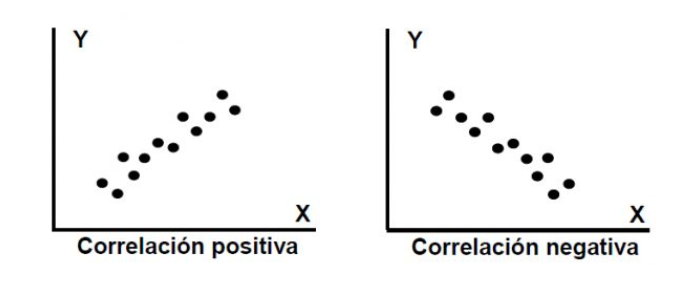

```{r setup, include=FALSE}
knitr::opts_chunk$set(echo = FALSE)
library(gtools)
library(ggplot2)
library(dplyr)
library(knitr)
library(kableExtra)
```

# PLAN DE LA CLASE

## **1.- Introducción**
    
- Concepto de permutación:
- ¿Qué es? ¿Por qué es importante? ¿Qué haremos?
- Permutación : caso 1, 2 y 3
- Problema de permutación.
- Prueba de correlación no paramétrica.

## **2). Práctica con R y Rstudio cloud.**

- Realizar cálculo de permutación usando R.
- Realizar prueba de correlación.
- Realizar gráficas avanzadas con ggplot2.

# PERMUTACIÓN

**¿Qué es?**  
Una permutación es una combinación ordenada de elementos.

**¿Por qué es importante?**  
El concepto matemático de permutación está subyacente a muchos métodos de análisis no paramétricos. 
 
**¿Qué haremos?**  
Calcularemos las posibles permutaciones de los elementos de un conjunto de datos de un experimento aleatorio y evaluaremos si se acepta o rechaza la hipótesis de las pruabas paramétricas más comunes. 

# PRÁCTICA PERMUTACIÓN

1.- Si para el conjunto {a,b} existen 2 permutaciones a-b y b-a

¿Cuántas permutaciones de los elementos {a,b,c} existen?
- P3 = 3! = 3 x 2 x 1 = 6

```{r, echo=TRUE}
factorial(3)
permutations(3,3,letters[1:3])
```

# CASO 2 - PERMUTACIÓN CON REPETICIÓN

- ¿Cuántas claves diferentes existen en el candado de 3 filas?

Para 3 filas con 10 números {0.. 9} existen 10 x 1 0 x 10 permutaciones = 1000.

```{r, echo=TRUE}
10^3
```

```{r, echo=FALSE, out.width = '40%', fig.align='center'}


```

# CASO 3 - PERMUTACIÓN CON REPETICIÓN

- ¿Cuántas permutaciones/palabras se forman la palabra GATA? Ej. {TAGA, …}

- Si, G = 1 vez; T = 1 vez y A = 2 veces , entonces

```{r, echo=TRUE}

factorial(4) / (factorial(1)*factorial(1)*factorial(2)) 

```


```{r, echo=FALSE, out.width = '35%', fig.align='center'}


```


# PRUEBA DE CORRELACIÓN NO PARAMÉTRICA

**¿Para que sirve?**    
Para estudiar asociación de dos variables, cuando no se cumple uno o varios supuestos de la correlación paramétrica: 

- Las variables X e Y no son continuas.  
- No existe relación lineal.  
- La distribución conjunta de (X, Y) no es una distribución Bivariable normal.  

```{r, echo=FALSE, out.width = '80%', fig.align='center'}


```

# EJEMPLO FUNCIÓN MONÓTONA

**¿Cuál es el supuesto que no se cumple?**  
No existe una relación lineal

```{r, out.width = '80%' }
set.seed(123)
x <- 1:20
y <- (1/4) * x^2 # Funcion monotona creciente

plot(x, y, type = 'b', main = 'Relación no lineal', frame.plot = FALSE, col = "dark red", lwd=2, font=2, cex.axis = 1.5)
```


# EJEMPLO VARIABLES DISCRETAS U ORDINALES

**¿Cuál es el supuesto que no se cumple?**  
Parásitos es variable discreta.

```{r, out.width = '80%' }
set.seed(0)
x <- trunc(runif(200)*10)
y <- x * 3 + trunc(runif(200)*10)
plot(y,x,pch=16, xlab = "Tamaño del pez", ylab = "parásitos", col = "red")
```

# CORRELACIÓN NO PARAMÉTRICA 

- Se basa en calcular el ranking de las variables.
- Calculamos ranking para cada variable.

|  **Fish size (X)** | **Parásitos (Y)**| **Ranking X ** | **Ranking Y** | 
|:-----:|:-----:|:-------:|:------:|
| 942 | 13 | 4 | 2 | 
| 101 | 14 | 1 | 3 | 
| 313 | 18 | 2 | 4 | 
| 800 | 10 | 3 | 1 | 

- Si la correlación es +, valores ordenados en ambas variables.
- Si la correlación en -, valores en orden inverso.
- Si la correlación es 0, valores desordenados.

# COEFICIENTE DE CORRELACIÓN DE SPEARMAN

**¿Cómo se calcula?**   

::: columns

:::: column

**Ranking X ** | **Ranking Y** | $$d$$  | $$d^2$$ |
|:-------:|:------:|:------:|:------:|
| 4 | 2 | 2 | 4 |
| 1 | 3 | -2 | 4 |
| 2 | 4 | -2 | 4 |
| 3 | 1 | 2 | 4 |

::::

:::: column

$$\rho = 1- \frac {6\sum d^2}{n(n^2-1)} = $$ 

$$\sum d^2 = 16$$   

$$\rho = 1- \frac {6*16}{4(4^2-1)} = $$ 

$$rho= -0,6 $$

::::

:::


# OTRAS CORRELACIONES POSIBLES

::: columns

:::: column

Opción 1: Correlación negativa.

| **Ranking X ** | **Ranking Y** |
|:----:|:-------:|
| 4 | 1 | 
| 1 | 4 |
| 2 | 3 |
| 3 | 2 | 
| $$\rho$$ = -1 |

::::

:::: column

Opción 2: Correlación positiva.

| **Ranking X **| **Ranking Y**  |
|:--------:|:-------:|
| 4 | 4 | 
| 1 | 1 | 
| 2 | 2 | 
| 3 | 3 | 
|$$\rho$$ = 1 |

::::

:::

# ¿CUÁNTAS CORRELACIONES SON POSIBLES?

- Calculamos número de permutaciones/correlaciones.  

```{r, echo=TRUE}
factorial(4)
```

- Las 24 permutaciones/correlaciones corresponden a nuestro espacio muestreal para 4 pares de variables.  

- Esto es independiente de las variables utilizadas.    

# ESPACIO MUESTRAL

- En nuestro experimento $$\rho= -0.6$$.
- 1 de 24 correlaciones posibles.

```{r}

x <- matrix(c(-1.0, -0.8, -0.8, -0.8, -0.6, -0.4, -0.4, -0.4, -0.4, -0.2, -0.2, 0.0, 0.0,  0.2, 0.2, 0.4, 0.4, 0.4, 0.4, 0.6, 0.8, 0.8, 0.8, 1.0), nrow = 3, ncol = 8, byrow = TRUE)
  
x %>%
  kable() %>%
  kable_styling()

```

# PRUEBA DE HIPÓTESIS DE CORRELACIÓN

|  **Hipótesis** | **Verdadera cuando**| 
|:-------------|:------------------|
| **H~0~**: X e Y mutuamente independientes | $$\rho$$ = 0|
| **H~1~**: X e Y no son mutuamente independientes | $$\rho$$ $$\ne$$ 0|

- ¿Cuántas correlaciones son >= 0.6 y <= -0.6? 

# DISTRIBUCIÓN MUESTRAL

- Solo por azar 10 correlaciones podrían tomar estos valores. 

```{r, out.width = '80%'}

My_Theme = theme(
  axis.title.x = element_text(size = 18),
  axis.text.x = element_text(size = 18),
  axis.title.y = element_text(size = 18),
  axis.text.y = element_text(size = 18))

x<- c(-1.0, -0.8, -0.8, -0.8, -0.6, -0.4, -0.4, -0.4, -0.4, -0.2, -0.2, 0.0, 0.0,  0.2, 0.2, 0.4, 0.4, 0.4, 0.4, 0.6, 0.8, 0.8, 0.8, 1.0)

dat<-tibble(x)
dat <- dat %>% mutate(color=case_when((x >= 0.6) ~ 1, x <= -0.6 ~ 1, TRUE ~ 0))

g <- ggplot(dat, aes(x=x,fill= color>=1)) +
  geom_bar(show.legend = FALSE)+
   scale_fill_manual(values=c("TRUE"="firebrick","FALSE"="blue"))+
  scale_x_continuous(breaks = c(-1.0, -0.8, -0.6, -0.4, -0.2, 0.0, 0.2, 0.4, 0.6, 0.8, 1.0), limits = c(-1.1,1.1)) + 
  labs(x="Coeficiente de correlación")

g+My_Theme

```


# PRUEBA DE HIPÓTESIS DE CORRELACIÓN

|  **Hipótesis** | **Verdadera cuando**| 
|:-------------|:------------------|
| **H~0~**: X e Y mutuamente independientes | $$\rho$$ = 0|
| **H~1~**: X e Y no son mutuamente independientes | $$\rho$$ $$\ne$$ 0|

p = 10 / 24  
p = 0.4167

No se rechaza **H~0~** porque p = 0,416 es mayor a 0,05

# PRUEBA DE CORRELACIÓN CON R

```{r, echo=TRUE}
# Crea objetos X e Y 
X <- c(942,101,313,800)
Y <- c(13,14,18,10)

# Realiza test de correlación
cor.test(X,Y, method = "spearman",
         alternative = "two.sided")

```

# RESUMEN DE LA CLASE

- Revisión de conceptos de permutación.
- Recordatorio correlación Pearson.
- Funciones monótonas.
- Uso de permutación para calcular espacio y distribución muestral.
- Aplicación interpretación prueba de correlación de Spearman con R.
