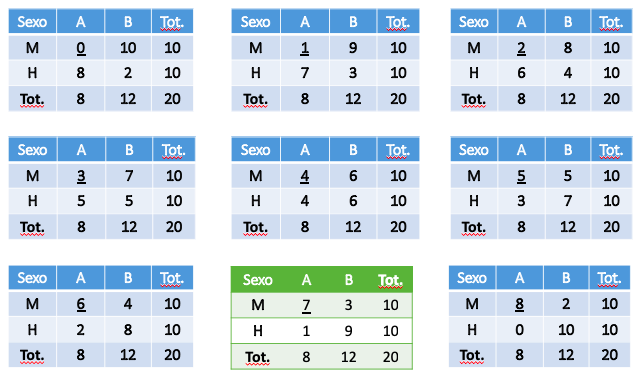

```{r setup, include=FALSE}
knitr::opts_chunk$set(echo = FALSE)
library(gtools)
library(ggplot2)
library(dplyr)
library(knitr)
library(kableExtra)
```

# PLAN DE LA CLASE

**1.- Introducción**
    
- Tablas de contingencia
- Prueba de chi cuadrado.
- Distribución chi cuadrado.
- Test exacto de Fisher.
- Interpretación test no paramétricos con R.\
&nbsp;

**2). Práctica con R y Rstudio cloud.**

- Prácticas R Prueba chi cuadrado y fisher.
- Realizar gráficas avanzadas con ggplot2.

# TABLAS DE CONTINGENCIA

- Se usan comúnmente para resumir datos de variables categóricas (ej. Cualitativas, dicotómicas).

- Se utilizan para investigar la asociación de dos o más variables categóricas una de las cuales es una variable respuesta y otra es una variable predictora.

|  **Tratamiento** | **Respuesta +**| **Respuesta -** | 
|:----:|:---:|:---:|
| Si | a | c | 
| No | b | d | 

# PRUEBA DE CHI CUADRADO

Esta prueba contrasta frecuencias observadas con las frecuencias esperadas de acuerdo con la hipótesis nula.

|  **Hipótesis** |
|:-------------:|
| **H~0~**: Variable predictora y respuesta son independientes. |
| **H~1~**: Variable predictora y respuesta NO son independientes. | 

**Supuestos:**  
- Los datos provienen de una muestra aleatoria.  
- El tamaño de muestra es lo suficientemente grande para que el número esperado en las categorías sea mayor 5 y que ninguna frecuencia sea menor que 1. 

# ESTUDIO DE CASO: ABUNDANCIA DE TIBURONES

En la siguiente tabla se muestra la abundancia de tiburones en 2 islas Chilenas.

|  **Especie** | Tiburón mako  | Tiburón azul | 
|:----|:---|:---|
| **Isla 1**| 30 | 80 | 
| **Isla 2**| 15 | 95 | 

|  **Hipótesis** |
|:-------------:|
| **H~0~**: La abundancia de tiburones mako y azul es independiente de las islas. |
| **H~1~**: La abundancia de tiburones mako y azul es dependiente de las islas. | 

# CÁLCULO DE ESTADÍSTICO CHI CUADRADO

**¿Cómo se calcula el estadístico Chi cuadrado?**   

$$ X^2 = \sum \frac {(freq. obs. - freq. esp.)^2}{(freq. esperada)} = \sum \frac {(O - E)^2}{(E)}$$

Frecuencia esperada
```{r, echo=FALSE}
# Crea matriz de datos
datos <- c(30, 15, 80, 95)
dim(datos) <- c(2,2)
# Test de Chi-squared en R (chisq.test)
test<-chisq.test(datos, correct = FALSE)
test$expected
test$statistic
```

# DISTRIBUCIÓN CHI CUADRADO

```{r, size="50%"}
par(mfrow = c(1,3))
curve(dchisq(x, df = 2), from = 0, to = 40,
      main = "grados de libertad = 2", #add title
      ylab = 'Density', #change y-axis label
      lwd = 2, #increase line width to 2
      col = 'steelblue',
      xlab="Valor chi cuadrado.") #change line color to steelblue
curve(dchisq(x, df = 6), from = 0, to = 40,
      main = "grados de libertad = 6", #add title
      ylab = 'Density', #change y-axis label
      lwd = 2, #increase line width to 2
      col = 'red',
      xlab="Valor chi cuadrado.") #change line color to steelblue
curve(dchisq(x, df = 12), from = 0, to = 40,
      main = "grados de libertad = 12", #add title
      ylab = 'Density', #change y-axis label
      lwd = 2, #increase line width to 2
      col = 'red',
      xlab="Valor chi cuadrado.") #change line color to steelblue
```

# VALOR CRITICO Y DISTRIBUCIÓN CHI-2

Se rechaza hipótesis nula, y por lo tantoconcluimos que no hay diferencia en los tratamientos.

```{r}
#create density curve
curve(dchisq(x, df = 1), from = 0, to = 15,
main = 'Valor crítico para p= 0,05 y 1 gl = 3,84',
ylab = 'Probabilidad',
lwd = 2,
xlab="Valor chi cuadrado.")

#find upper and lower values for middle 95% of distribution
upper95 <- qchisq(.95, 1)

#create vector of x values
x_upper95 <- seq(upper95, 40)

#create vector of chi-square density values
p_upper95 <- dchisq(x_upper95, df = 1)

#fill in portion of the density plot for upper 95% value to end of plot
polygon(c(x_upper95, rev(x_upper95)), c(p_upper95, rep(0, length(p_upper95))),
        col = adjustcolor('red', alpha=0.3), border = NA)

text(6, 0.22, "Valor crítido = 3,84")
arrows(x0 = 3.84,
       y0 = 0.2,
       x1 = 3.84,
       y1 = 0.04)


text(9.28, 0.135, "Chi-observado = 6,28")
arrows(x0 = 7.28,
       y0 = 0.1,
       x1 = 6.28,
       y1 = 0.04)

```

# PRUEBA DE CHI CUADRADO CON R

```{r, echo=TRUE}
# Crea matriz de datos
datos <- c(30, 15, 80, 95)
dim(datos) <- c(2,2)
# Test de Chi-squared en R (chisq.test)
chisq.test(datos, correct = FALSE)
```

# PRUEBA DE FISHER

- Se utiliza en tablas de contingencia.

- Se prefiere cuando el número de observaciones es pequeño.

- Pero es válido para cualquier tamaño de observaciones.

- Requiere calcular las probabilidades individuales para las distintas maneras en que pueden aparecer las frecuencias dentro de las 4 celdas, manteniendo constantes las frecuencias marginales, sumando las probabilidades correspondiente a las pregunta de interes. 


# ESTUDIO DE CASO: PREFERENCIA DE ALIMENTACION EN MOLUSCOS

En la siguiente tabla se muestra la preferencia de alimentación de una especie de molusco.

|  **Sexo** | Food A  | Food B | 
|:----|:---|:---|
| **Macho**| 7 | 3 | 
| **Hembra**| 1 | 9 | 

|  **Hipótesis** |
|:-------------:|
| **H~0~**: La preferencia de alimentos A y B es independiente del sexo. |
| **H~1~**: La preferencia de alimentos A es mayor en Machos | 


Fuente: Modificado de Clifford and Taylor, 2008

# PROBABILIDAD EXACTA DE FISHER

|  **Tratamiento** | Respuesta +  | Respuesta - | Total |
|:---:|:---:|:---:|:---:|
| **1**| a | b | g = a + b |
| **2**| c | d | h = c + d |
| Total | e = a + c | f = b + d | n|

Probabilidad exacta de Ficher. 

$$P (a) = \frac{e!*f!*g!*h!}{a!*b!*c!*d!*n!}  $$

# PROBABILIDAD EXACTA DE FISHER

Preferencia de alimentación con totales marginales.

|  **Sexo** | Food A  | Food B | Total |
|:---:|:---:|:---:|:---:|
| **Macho**| 7 | 3 | 10 |
| **Hembra**| 1 | 9 | 10 |
| Total | 8| 12 | 20 |

Probabilidad exacta de Ficher. 

$$P (a) = \frac{8!*12!*10!*10!}{7!*3!*1!*9!*20!}  $$

# TABLAS DE CONTINGENCIA ALTERNATIVAS

Generadas de todas las permutaciones posibles.  

```{r, echo=FALSE, out.width = '100%' }

```

# DISTRIBUCIÓN DE PROBABILIDAD

**H~0~**: La preferencia de alimentos A y B es independiente del sexo.  
**H~1~**: La preferencia de alimentos A es mayor en Machos.  

\columnsbegin
\column{.5\textwidth}

| a | $P(a)$  |
|:---:|:---:|
| 0| 0,00036 |
| 1| 0,00953 |
| 2| 0,07502 |
| 3| 0,24006 |
| 4| 0,35008 |
| 5| 0,24006 |
| 6| 0,07502 |
| **7**| **0,00953** |
| **8**| **0,00036** |

\column{.5\textwidth}

La probabilidad de obtener un valor de a mayor o igual que 7 = P(7) + P(8) = 0,00953 + 0,00036 = 0,00989.

**Conclusión**: Se rechaza **H~0~**.

\columnsend

# PRUEBA EXACTA DE FISHER CON R

```{r, echo=TRUE}
Prueba_fisher <- matrix(c(7, 3, 1, 9), nrow= 2)

fisher.test(Prueba_fisher, alternative = "greater")
```


# RESUMEN DE LA CLASE

- Tablas de contingencia.\
&nbsp;  
- Prueba de chi cuadrado.\
&nbsp;
- Distribución chi cuadrado.\
&nbsp;  
- Test exacto de Fisher.\
&nbsp;  
- Interpretación test no paramétricos con R.  
