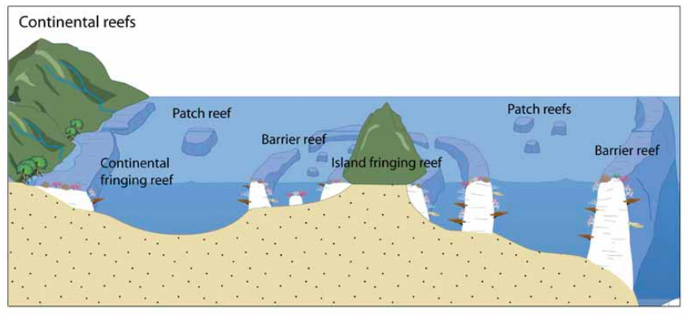
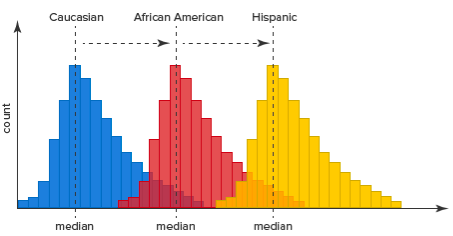

```{r setup, include=FALSE}
knitr::opts_chunk$set(echo = FALSE)
library(gtools)
library(ggplot2)
library(dplyr)
library(knitr)
library(kableExtra)
```

# PLAN DE LA CLASE

**1.- Introducción**
    
- Comparación de 2 muestras independientes.
- Comparación de muestras independientes pareadas.
- Comparación de múltiples muestras independientes.
- Interpretación test no paramétricos con R.\
&nbsp;

**2). Práctica con R y Rstudio cloud.**

- Prácticas pruebas de contraste de hipótesis no paramétricas.
- Realizar gráficas avanzadas con ggplot2.

# COMPARACIÓN DE DOS MUESTRAS INDEPENDIENTES

**¿Para qué sirve?**   
Para comparar dos muestras con idéntica distribución, con diferentes medianas y sin normalidad.

Usualmente para variables discretas.

```{r, echo=FALSE, out.width = '70%' }
knitr::include_graphics("No_par.png")
```

# PRUEBA DE MANN-WHITNEY (W)

Estudio de caso: Comparación del reclutamiento de ostras en el intermareal entre dos sitios (S1 y S2) [**Adaptado de Deck, 2007**](https://nsgl.gso.uri.edu/casg/casgy11006.pdf).

|  **Nº ostras S1** | **Nº ostras S2**| 
|:---:|:---:|
| 9 | 0 |
| 12 | 4 | 
| 13 | 6 | 

# CÁCULO DE ESTADÍSTICO MANN-WHITNEY (W)

**¿Cómo se calcula el estadístico W?**   
Como la diferencia de los ranking entre tratamiento y control

|  **S1** | **S2**| **Ranking S1 ** | **Ranking S2** |
|:----------:|:---------:|:--------:|:--------:|
| 9 | 0 | 4 | 1 | 
| 12 | 4 | 5 | 2 | 
| 13 | 6 | 6 | 3 | 
|  |  |  $$\sum$$ = 15 | $$\sum$$ = 6 |

*W* = 15 - 6 = 9  
Máxima diferencia posible entre S1 y S2.


# ¿CUÁNTAS COMBINACIONES SON POSIBLES?

¿Cuántas combinaciones son posibles?

6! / 3! X 3! = 720 / 36 = 20


::: columns

:::: column
|  **S1** | **S2**| 
|:-----:|:--------:|
| 1 | 4 |
| 2 | 5 | 
| 3 | 6 |
|  *6*   | *15* | 
|  *W* =  | **- 9** |
::::

:::: column
| **S1** | **S2** |
|:---------:|:---------:|
 | 2 | 1 | 
| 5 | 3 | 
| 6 | 4 | 
| *13*  | *8* |
| *W* =    | **5** |

::::

:::


# DISTRIBUCIÓN MUESTRAL DE W

```{r, out.width = '90%'}
My_Theme = theme(
  axis.title.x = element_text(size = 18),
  axis.text.x = element_text(size = 18),
  axis.title.y = element_text(size = 18),
  axis.text.y = element_text(size = 18))

w<- c(-9, -7, -5, -5, -3, -3, -3, -1, -1, -1, 1, 1, 1, 3, 3, 3,5,5,7,9)

dat<-tibble(w)
dat <- dat %>% mutate(color=case_when((w >=9) ~ 1, TRUE ~ 0))

g <- ggplot(dat, aes(x=w,fill= color>=1)) +
  geom_bar(show.legend = FALSE)+
   scale_fill_manual(values=c("TRUE"="firebrick","FALSE"="blue"))+
  scale_x_continuous(breaks = c(-9, -7, -5, -5, -3, -3, -3, -1, -1, -1, 1, 1, 1, 3, 3, 3,5,5,7,9), limits = c(-10,10)) + 
  labs(x="Diferencia de rangos (W)")

g+My_Theme

```

# PRUEBA DE HIPÓTESIS DE MANN-WHITNEY

|  **Hipótesis** |
|:-------------:|
| **H~0~**: S1 = S2 |
| **H~1~**: S1 > S2 | 

Resultado obtenido W=9.  
p = 1/20  
p = 0.05  

No se rechaza **H~0~** porque p = 0,05


# PRUEBA DE MANN-WHITNEY CON R

```{r, echo=TRUE}
# Crea objetos tratamiento y control
t <- c(9, 12, 13)
c <- c(0, 4, 6)

# Realiza prueba de Mann-Whitney
wilcox.test(t, c, alternative = "g",
            paired = FALSE)
```

# COMPARACIÓN DE MUESTRAS PAREADAS

**¿Para que sirve?**   
Para comparar dos muestras *pareadas* con idéntica distribución, con diferentes medianas y sin normalidad.

```{r, echo=FALSE, out.width = '90%' }
knitr::include_graphics("pareadas.png")
```

# PRUEBA DE WILCOXON MUESTRAS PAREADAS

Estudio de caso: Comparación de productividad béntica (Coral Path Reef) entre dos tiempos. [**Adaptado de Toro-Farmer et al. 2016**](https://www.mdpi.com/2072-4292/8/2/86/htm)

```{r, echo=FALSE, out.width = '90%' }

```

# DATOS SIMULADOS DE PRODUCTIVIDAD

¿Aumenta la productividad?

|  **Arrecife de coral** | **Mes 1**| **Mes 2** | $$d$$ |  Ranking con signo |
|:------:|:------:|:------:|:------:|:-------:|
| 1 | 45 | 49 | 4 | **2** |
| 2 | 41 | 50 | 9 | **4** |
| 3 | 47 | 52 | 5 | **3** |
| 4 | 52 | 50 | 2 | **-1** |

W = suma de los ranking = 8  
V = suma de casos positivos (aumenta) = 9


# DISTRIBUCIÓN MUESTRAL DE W

¿Cuántas combinaciones de signos (+ o -) son posibles?
$2^4=16$  

```{r, out.width = '90%'}
w<- c(-10, -8, -6, -4, -4, -2, -2, 0, 0, 2, 2, 4, 4, 6, 8, 10)

dat<-tibble(w)
dat <- dat %>% mutate(color=case_when((w >=8) ~ 1, TRUE ~ 0))

g <- ggplot(dat, aes(x=w,fill= color>=1)) +
  geom_bar(show.legend = FALSE)+
   scale_fill_manual(values=c("TRUE"="firebrick","FALSE"="blue"))+
  scale_x_continuous(breaks = c(-10, -8, -6, -4, -4, -2, -2, 0, 0, 2, 2, 4, 4, 6, 8, 10), limits = c(-11,11)) + 
  labs(x="Diferencia de signos (W)")

g+My_Theme

```


# PRUEBA DE HIPÓTESIS DE WILCOXON

|  **Hipótesis** |
|:-------------:|
| **H~0~**: d = 0 |
| **H~1~**: d > 0 | 

p = 2/16  
p = 0,125

No se rechaza **H~0~** porque p = 0,125 es mayor a 0,05

# PRUEBA DE WILCOXON PAREADAS CON R

```{r, echo=TRUE}
# Crea objetos pre y post
pre <- c(45, 41, 47, 52)
post <- c(49, 50, 52, 50)
# Realiza prueba de Wilcoxon
wilcox.test(post - pre, alternative = "greater")
# no es necesario indicar muestras pareadas
# pues estamos haciendo la resta en la función.

```

# COMPARACIÓN DE MÚLTIPLES MUESTRAS INDEPENDIENTES

**¿Para que sirve?**   
Para comparar múltiples muestras con idéntica distribución, con diferentes medianas y sin normalidad.

```{r, echo=FALSE, out.width = '90%' }

```

# PRUEBA DE KRUSKAL - WALLIS

Estudio de caso: Comparación de abundancia de zooplancton entre estaciones [**Adaptado de Torreblanca et al. 2016**](https://www.scielo.cl/scielo.php?script=sci_arttext&pid=S0718-19572016000200006).

|  **Verano** | **Otoño**| **Invierno** | **Primavera**
|:---:|:---:|:---:|:---:|
| 900 | 600 | 500 |50 | 
| 800 | 650 | 450 |40 | 
| 700 | 550 | 400 |75 | 
| 750 | 500 | 475 |100 | 

|  **Hipótesis** |
|:-------------:|
| **H~0~**: La distribución de los k grupos son iguales. |
| **H~1~**: Al menos 2 grupos son distintos. | 

# PRUEBA DE KRUSKAL - WALLIS CON R

```{r, echo=TRUE}
V <- c(900,800,700,750) # Verano
O <- c(600,650,550,500) # Otoño
I <- c(500,450,400,475) # Invierno
P <- c(50,40,75,100) # Primavera
kt <- kruskal.test(list(V, O, I,P))
kt[["statistic"]]
kt[["parameter"]]
kt[["p.value"]]
```


# RESUMEN DE LA CLASE

- Comparación de 2 muestras independientes.\
&nbsp;
- Comparación de muestras independientes pareadas.\
&nbsp;
- omparación de múltiples muestras independientes.\
&nbsp;
- Interpretación test no paramétricos con R.  
