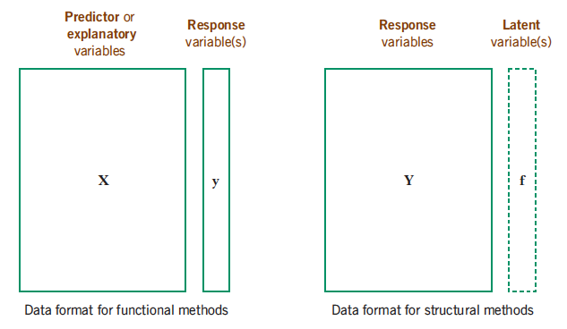
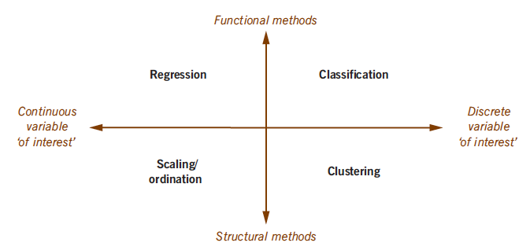
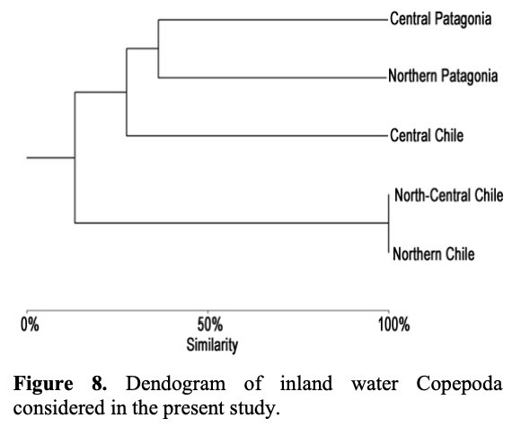
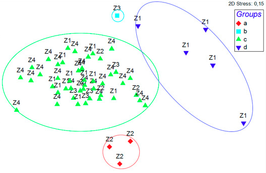

```{r setup, include=FALSE}
knitr::opts_chunk$set(echo = FALSE)
library(readxl)
library(ggplot2)
library(dplyr)
library(knitr)
library(kableExtra)
```

# PLAN DE LA CLASE

**1.- Introducción**
    
- ¿Qué son los análisis mulvariantes?.
- Estudios de caso: Análisis de cluster, análisis de
componentes principales.
- Matriz de distancia: cálculo manual

**2). Práctica con R y Rstudio cloud.**

- Matriz de distancia: cálculo con R

# INRRODUCCIÓN ANÁLISIS MULTIVARIANTE

**¿Qué son los análisis multivariantes?**   
Son un conjunto diverso de métodos que estudian y examinan el efecto simultáneo de múltiples variables.

```{r, echo=FALSE, out.width = '70%' }
bioenv <- read_excel("bioenv.xlsx", sheet = 1)
kable(head(bioenv))
```

# TIPOS DE MÉTODOS MULTIVARIANTES (MM)

```{r, echo=FALSE, out.width = '90%' }

```

Fuente: [Multivariate Statistic, 2014](https://www.fbbva.es/microsite/multivariate-statistics/legal.html)

# MÉTODOS MULTIVARIANTES SEGÚN TIPO DE VARIABLE

```{r, echo=FALSE, out.width = '90%' }

```

Fuente: [Multivariate Statistic, 2014](https://www.fbbva.es/microsite/multivariate-statistics/legal.html)


# ESTUDIOS DE CASO: ZOOGEOGRAFÍA DE CRUSTACEOS

Agrupamiento jerarquico.  
```{r, out.width='70%'}

```

Fuente: [De los Ríos-Escalante et al, 2013](https://www.scielo.cl/scielo.php?script=sci_arttext&pid=S0718-560X2013000500005)

# ESTUDIOS DE CASO: POLIQUETOS

Escalamiento multidimensional no métrico (NMDS).    
```{r, out.width='70%'}

```

Fuente: [Sanchis, Soto y Quiroga, 2021](https://doi.org/10.1016/j.marpolbul.2021.112309)

# ESTUDIOS DE CASO: 

# MATRIZ DE DISTANCIA O SIMILARIDAD

**¿Qué es y para que sirve?**  
- Las matrices de distancia o similaridad están en la base de todos los análisis multivariados de estructura. 

**Algunas consideraciones**  
- Las matrices de distancia se pueden elaborar tanto para variables cuantitativas continuas, como discrertas.

- Debido a que las variables pueden tener diferente escala o magnitud es necesario muchas veces tansformar o estandarizar las variables antes de calcular las matrices de distancia.

- Cuando una variable tiene muchos ceros también es conveniente transformarla.


# TIPOS DE MATRICES DE DISTANCIA 

- **Euclideana** Para variables cuantitativas continuas.  
  Con base en el teorema de pitágoras  
  $c^2= a^2 +b^2$  
  $a= \sqrt{c^2-b^2}$  
  $b= \sqrt{c^2-a^2}$  
  $c= \sqrt{c^2+b^2}$  

- **No euclideana**: Para variables cuantitativas discretas (conteos).  
 Diferentes alternativas: Bray-Curtis.  
 
# ISTANCIA EUCLIDEANA

- Evaluemos efecto de escala de las variables. \
&nbsp;
```{r}
tabla <- bioenv %>% select(Sitio, Depth, Pollution, Temp.) %>% filter(Sitio %in% c("s29", "s30"))

kable(tabla)
```

  $s20-s30=\sqrt{(x_1-y_1)^2+(x_2-y_2)^2+(x_3-y_3)^2}$.\
&nbsp;
  
  $s20-s30=\sqrt{(51-99)^2+(6.0-1.9)^2+(3.0-2.9)^2}$.\
&nbsp;
  
  $s20-s30=\sqrt{(2304)+(18.81)+(0.01)}= 48.17$
  
# ESTANDARIZACIÓN

|  | **Depth**| **Pollution** | **Temperature** |
|:------:|:------:|:------:|:------:|
| **Mean** | 74,43 | 4,52 | 3,06 |
| **sd** | 15,61 | 2,14 | 0,28 |

Valor estandarizado : (valor original – mean) / sd  
Valor estandarizado s29 : (51 – 74,43) / 16,61 = -1,501

| **Sitio** | **Depth**| **Pollution** | **Temperature** |
|:------:|:------:|:------:|:------:|
| **S29** | -1,501 | 0,693 | -0,201 |
| **s30** | 1,573 | -1,222 | -0,557 |


# DISTANCIA EUCLIDEANA ESTANDARIZADA

| **Sitio** | **Depth**| **Pollution** | **Temperature** |
|:------:|:------:|:------:|:------:|
| **S29** | -1,501 | 0,693 | -0,201 |
| **s30** | 1,573 | -1,222 | -0,557 |

  $s20-s30=\sqrt{(-1,501-1,573)^2+(0,693--1,22)^2+(0,201-0,557)^2}$.\
&nbsp;
  
  Distancia estandarizada.  
  $s20-s30=\sqrt{(9,499)+(3,667)+(0,127)}= 3,639$.\
&nbsp;
  Distancia no estandarizada.  
  $s20-s30=\sqrt{(2304)+(18.81)+(0.01)}= 48.17$

# DISTANCIA NO EUCLIDEANA

```{r}
tabla <- bioenv %>% select(Sitio, a,b,c,d,e) %>% filter(Sitio %in% c("s29", "s30"))

kable(tabla)
```


$s20-s30= \frac{\sum|n_ij-n_ij|}{\sum n_i + \sum n_j}$.\
&nbsp;

$s20-s30= \frac{|11-24|+|0-37|+|7-5|+|8-18|+|0-1|}{26+ 85}=\frac{63}{111}=0,568$


# RESUMEN DE LA CLASE

- Revisión e importancia de análisis multivariantes.\
&nbsp;
- Estudios de caso: analisis de cluster jerarquico (dendograma) y análisis de .\
&nbsp;
- Calculo de matriz de distancia manual\
&nbsp;
- - Calculo de matriz de distancia con R\
&nbsp;