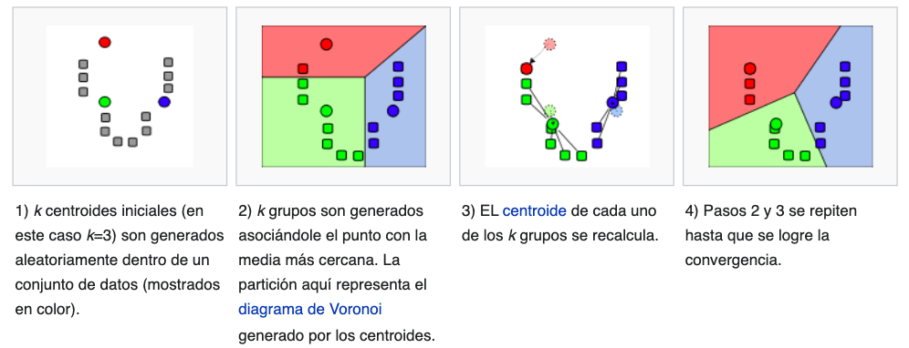

```{r setup, include=FALSE}
knitr::opts_chunk$set(echo = FALSE)
library(readxl)
library(ggplot2)
library(dplyr)
library(knitr)
library(kableExtra)
```

# PLAN DE LA CLASE

**1.- Introducción**
    
- ¿Qué son los análisis de cluster?
- Clasificación: jerárquico v/s no jerárquico
- Elaborar análisis de cluster jerárquico manual


**2). Práctica con R y Rstudio cloud.**

- Elaborar análisis de cluster jerárquico y no jerárquico con R.

# ANÁLISIS DE CLUSTER

**¿Qué son los análisis de cluster?**   
Son herramientas de exploración de datos que permiten agrupar y visualizar datos multivariados con base a su similitud (matriz de distancia).

```{r, echo=FALSE, out.width = '90%' }

```

Fuente: [Vihtakari, et al. 2018](https://doi.org/10.1038/s41598-017-19118-8)
# TIPOS DE MÉTODOS MULTIVARIANTES (MM)


# ANALISIS DE CLUSTER: CLASIFICACION 

**Jerárquico**: Los grupos se fusionan sucesivamente siguiendo una jerarquía de homogeneidad, la cual decrece a medida que se agregan más elementos al grupo. 

**No jerárquico**: Se forman grupos homogéneos sin establecer relaciones o jerarquía  entre ellos.

```{r, echo=FALSE, out.width = '90%' }

```

Fuente: [Multivariate Statistic, 2014](https://www.fbbva.es/microsite/multivariate-statistics/legal.html)


# ANALISIS JERÁRQUICO: MÉTODO

**¿Qué hace el algoritmo estándar?**  
	1. Agrupa dos elementos por su similitud.
	2. Recalcula la matriz de distancia (muchas opciones).
	3. Vuelve a punto 1.
	4. Finaliza cuando todos los elementos han sido asignados a 	cluster.

**¿Cómo recalculo la matriz?**  
1. Método de distancia máxima (vecino más lejano). 
2. Método de distancia mínima (vecino más próximo).
3. Método UPGMA (unweighted Pair-group arithmetic averages).

# ANALISIS NO JERÁRQUICO: MÉTODO

**Métodos K-MEANS**

**¿Qué hace el algoritmo k-means?**  
1. Se crea un conjunto inicial de k centroides (lo define el investigador).
2. Asigna cada elemento al grupo con la media más cercana.
3. Calcula un nuevo centroide para cada grupo.
4. Finaliza cuando las asignaciones no cambian


# MÉTODO K-MEANS

```{r, echo=FALSE, out.width = '90%' }

```

Fuente: https://es.wikipedia.org/wiki/K-medias 

# VENTAJAS Y DESVENTAJAS

Jerárquico
Ventajas:
	No requiere especificar Nº de grupos al inicio.
Desventajas:
	Difícil decidir que grupos son relevantes y cuales no.
	Difícil de interpretar cuando existen muchos 	elementos.

No jerárquico:
Ventajas:
	Útil cuando existen muchos elementos.
Desventajas:
	El número de cluster que se define al inicio, podría no ser el adecuado.

# EJEMPLO ESTUDIO DIVERSIDAD ESPECIES

- ¿Cuán similares son las muestras entre si?
- ¿Qué muestras pertenecen a un mismo grupos (variable latente)?

```{r, echo=FALSE, out.width = '90%' }

```

Fuente: [Multivariate Statistic, 2014](https://www.fbbva.es/microsite/multivariate-statistics/legal.html)

# INDICE DE JACARD

Índice de Similitud de Jaccard es muy utilizado en Oceanografía para expresar el grado en el que dos muestras son semejantes por las especies presentes en ellas. 

- Co-presencias (a)
- Co-ausencias (d)
- No coincidentes (b + c)

```{r, echo=FALSE, out.width = '90%' }

```


# CALCULE INDICE DE JACARD

```{r, echo=FALSE, out.width = '90%' }

```

# MATRIZ DE SIMILARIDAD DE JACARD

```{r, echo=FALSE, out.width = '100%' }

```

# AGRUPAMIENTO JERARQUICO: PASO 1

Construcción del primer nodo: Mayor similitud entre B y F

```{r, echo=FALSE, out.width = '100%' }

```

# AGRUPAMIENTO JERARQUICO: PASO 2

```{r, echo=FALSE, out.width = '90%' }

```

# AGRUPAMIENTO JERARQUICO: PASO 2.1

```{r, echo=FALSE, out.width = '90%' }

```

# AGRUPAMIENTO JERARQUICO: PASO 2.2


```{r, echo=FALSE, out.width = '90%' }

```

# AGRUPAMIENTO JERARQUICO: PASO 3

```{r, echo=FALSE, out.width = '100%' }

```

# AGRUPAMIENTO JERARQUICO: PASO 4

```{r, echo=FALSE, out.width = '90%' }

```

# AGRUPAMIENTO JERARQUICO: PASO 4.1

```{r, echo=FALSE, out.width = '90%' }

```

# AGRUPAMIENTO JERARQUICO: PASO 5

Construcción del tercer nodo: Mayor similitud entre C y G

```{r, echo=FALSE, out.width = '100%' }
knitr::include_graphics("Paso5.png")
```

# AGRUPAMIENTO JERARQUICO: PASO 6

Construcción del cuarto nodo: Mayor similitud entre A-E y C-G

```{r, echo=FALSE, out.width = '100%' }

```

# AGRUPAMIENTO JERARQUICO: PASO 7

Construcción del quinto y sexto nodo: Mayor similitud entre A-E-C-G con B-F y entre estos con D.


```{r, echo=FALSE, out.width = '100%' }

```


# INTERPRETACIÓN CLUSTER JERÁRQUICO

- Establecemos nivel de agrupamiento = 0.5.
- Bajo 0.5 hay mas similaridad (Co-presencias).
- Se observan 3 grupos o cluster.

```{r, echo=FALSE, out.width = '50%' }

```


# RESUMEN DE LA CLASE


- ¿Qué son los análisis de cluster?.\
&nbsp;
- Analisis de cluster jerarquico (dendograma).\
&nbsp;
- Analisis de cluster no jerarquico.\
&nbsp;
- Indice de Jacard para datos de conteo (diversidad de especies).\
&nbsp;