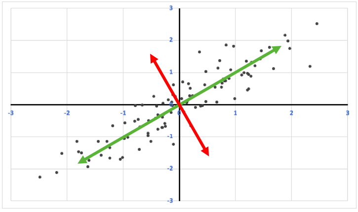
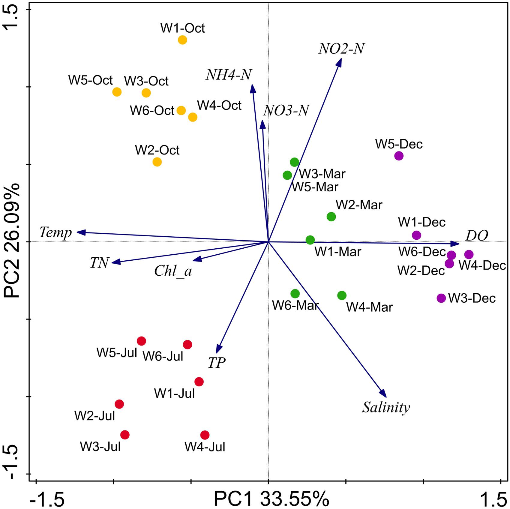

```{r setup, include=FALSE}
knitr::opts_chunk$set(echo = FALSE)
library(readxl)
library(ggplot2)
library(dplyr)
library(knitr)
library(kableExtra)
```

# PLAN DE LA CLASE

**1.- Introducción**
    
- ¿Qué son los análisis de componentes principales?
- ¿Qué son los componentes principales?
- Etapas para realizar un ACP.
- Varianza explicada.
- Graficas biplot

**2). Práctica con R y Rstudio cloud.**

- Elaborar análisis de componentes principales con R

# ANÁLISIS DE COMPONENTES PRINCIPALES

- **¿Qué son los análisis de componentes principales?**   
a) Son una herramienta estadística multivariada que se utiliza para realizar análisis exploratorio de datos y para construir modelos predictivos.\
&nbsp;
b) Permite reducir la dimensionalidad de un set de datos con muchas variables respuesta, sin perder mucha información.\
&nbsp;
c) Permite encontrar patrones en un set de datos mediante el calculo de los “componentes principales”.

# COMPONENTES PRINCIPALES

- ¿Qué son los componentes principales?  
Combinación lineal de las variables originales no correlacionadas entre si (perpendiculares / ortogonales).

```{r, echo=FALSE, out.width = '90%' }

```

# ETAPAS PARA REALIZAR UN ACP

1) Estandariza datos: Media 0 y varianza 1.
2) Calcula la matriz de var/cov de datos estandarizados.
3) Calcula los valores y vectores propios (Eigenvalue y Eigenvector) de la matriz.
4) Interpretación y gráficas biplot.

```{r, echo=FALSE, out.width = '80%' }
knitr::include_graphics("Transformacion.png")
```

Fuente: [Rodriguez](http://www.oldemarrodriguez.com/yahoo_site_admin/assets/docs/cap2.143111051.pdf)

# VARIANZA EXPLICADA

La varianza explicada acumulada muestra que los primeros dos componentes principales pueden capturar mucha de la varianza explicada por todas las variables analizadas. Cada eigenvalue estima la varianza explicada por cada CP.

```{r, echo=FALSE, out.width = '90%' }
knitr::include_graphics("Varianza.png")
```

# GRÁFICAS BI-PLOT

- 2 eigenvector o componentes principales para cada variable.
- Correlación de variables.
- Observaciones.

```{r, echo=FALSE, out.width = '60%' }

```

Fuente: [He, et al. 2017](https://www.frontiersin.org/articles/10.3389/fmicb.2017.01579/full)

# RESUMEN DE LA CLASE

- ¿Qué es un análisis de componentes principales?.\
&nbsp;
- ¿Qué son los componentes principales?.\
&nbsp;
- Etapas para realizar un ACP.\
&nbsp;
- Varianza explicada.\
&nbsp;
- Graficas biplot.